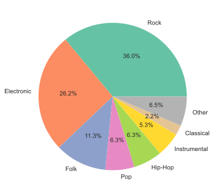
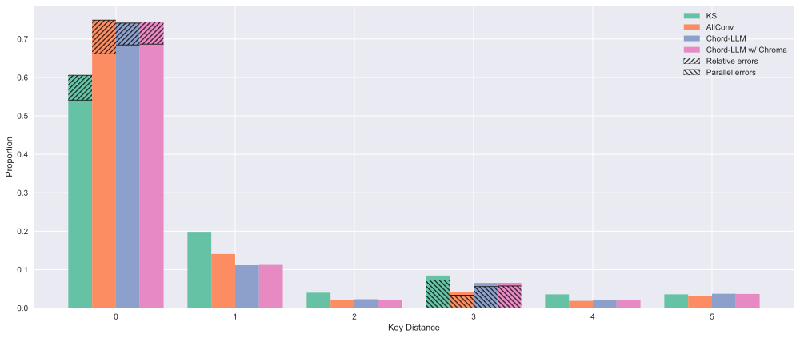

<style>
figcaption { text-align: center; }
.roman { font-family: Georgia, "Times New Roman", serif; font-variant: small-caps; }
#tbl-mirex-score table { width: auto; margin-left: auto; margin-right: auto; }
</style>

*I wanted to see whether large language models could reliably estimate musical key from just the output of a chord recognizer. I tested this out using the FMAK dataset, and compared to two baselines. Turns out the LLM-driven method is pretty good at this task, which is surprising given how little information the LLM uses to make a prediction. Further, if we combine the LLM method with a strong deep learning approach, we will get a hybrid system that outperforms both.*

*This research was adapted from my final project completed for MPATE-GE 2623 Music Information Retrieval taught by Brian McFee at NYU. The methods and writeup presented here are completely my own, though the experimental setup and baseline evaluations come from the class project. Therefore, credit is also due to my team members: Shan Shan Tu, Jason Lee, and Teddy Ryles.*

*To reproduce the results and analyses detailed here, see the [GitHub Repo](https://github.com/jeffgord/llm-key-estimation).*

---

todo: replace all sharps and flats with correct symbols.

### *What is key estimation and why is it hard?*

{#fig-key-estimation-task}

Key estimation is a classic music information retrieval (MIR) problem, where a computer is tasked with identifying the key of a musical piece (see @fig-key-estimation-task). Usually, key estimation is formulated as a straightforward multi-class classification problem, where the output of a key estimator is one of 24 classes: one of 12 roots × one of 2 qualities (major or minor). Enharmonic spellings (i.e. *Db minor* vs. *C# minor*) are considered to be equivalent, since these differences can't be discerned from the audio alone.

Notably, key estimation is a somewhat underexplored problem in MIR, at least compared to other popular MIR tasks (TODO: provide some evidence for this). One possible explanation for this is that the applications of a key estimator are relatively limited. Beat detectors and chord recognizers are vital for stuff like automatic transcription or real-time machine accompaniment. But there are far fewer uses for estimating the key of a song, aside from metadata collection perhaps.

Still, it's an interesting problem to work on. From a musical perspective, defining a song's key is a rather dubious task. Music is often about shifting between keys, or maybe being in one key but gesturing at another (like when the bridge of a jazz tune \"modulates\" to the <span class="roman">IV</span>). So it's not always straightforward to say exactly what the key of a song is with the conciseness that a multi-class classification setup demands.

Because key estimation is underexplored, the available datasets are fairly small and quirky. For a while, the most popular datasets were GiantSteps Key (600 tracks) and Beatport EDM Key (1,486 tracks), both of which include only EDM songs. This lack of data, both in terms of quantity and diversity, is a big issue for machine learning approaches. When humans figure out a song's key, they are usually thinking about very high level musical information -- e.g. looking at which chord ends each section, finding <span class="roman">V-I</span> cadences, etc.. It seems unlikely that an algorithm could uncover these kinds of complex, high-level patterns from limited data.

### *Using LLMs for Key Estimation*

One way to deal with a lack of labeled data is to rely in part on a foundation model, which trains on a large corpus of unlabeled data in a self-supervised fashion. The hope is that this process encourages your model to learn generalizable representations, which can then be fine-tuned for many different tasks with just a small amount of labeled data. Indeed, a pre-trained music foundation model like MERT would probably work well for key estimation.

LLMs are another kind of foundation model which have been *quite* popular lately. And with so much money poured into their by development by frontier labs, they should be good at lots of different tasks. But the problem with using LLMs for music tasks is that they operate on text, not audio.[^text-not-audio] So to use them for key estimation, we need some way to represent music as text.

[^text-not-audio]: You might point out that we have strong multimodal models nowadays, which actually do process audio. Unfortunately, it turns out that recent multimodal LLMs are pretty bad at MIR (see @pmlr-v303-carone26a and @morais2026modality). And since it's expensive to process audio tokens, I just didn't think it worth my time/money to focus on. Still, an interesting project might be to benchmark multimodal LLMs on this task (or similar MIR tasks), and track their improvement over time.

###  *Chord Recognizers: Music → Text*

In fact, there a many ways to represent music as text, though all of them are lossy. For instance, you could just describe it: *this song sounds like a summer's day, but ruined by violins*. Or you could use music notation that has been converted to words through some process, such as musicXML:

```xml
<note>
  <pitch><step>G</step><octave>4</octave></pitch>
  <duration>1</duration>
  <type>eighth</type>
  <lyric><syllabic>single</syllabic><text>Hap-</text></lyric>
</note>
<note>
  <pitch><step>G</step><octave>4</octave></pitch>
  <duration>1</duration>
  <type>eighth</type>
  <lyric><syllabic>single</syllabic><text>py</text></lyric>
</note>
<note>
  <pitch><step>A</step><octave>4</octave></pitch>
  <duration>2</duration>
  <type>quarter</type>
  <lyric><syllabic>single</syllabic><text>birth-</text></lyric>
</note>
...
```

For a whole song with multiple instruments, this would quickly get out of hand, though. And there's a lot of information in this representation that isn't useful for our task (like lyrics).

So, we need a compact representation with task-relevant information. We've already discussed how key can often be inferred from a song's harmony and structure, so a good choice might be a chord chart (like [iReal Pro](https://www.irealpro.com/) style). Unfortunately, we don't yet have machines that can reliably write out a song's chart with labeled sections and all. But we can get pretty close with a chord recognizer, which processes music, and spits out its best guess as to what chords are happening and for how long. Here's an example of what a chord recognizer outputs on a real 60s snippet of audio:

```
0.0	8.870022675736962	N
8.870022675736962	16.6487074829932	Ab:maj
16.6487074829932	17.34530612244898	F#:maj
17.34530612244898	19.481541950113378	B:maj
19.481541950113378	21.478458049886623	A:maj
21.478458049886623	29.83764172335601	Ab:maj
29.83764172335601	31.90421768707483	B:maj
31.90421768707483	33.97079365079365	A:maj
33.97079365079365	42.32997732426304	Ab:maj
42.32997732426304	44.489433106575966	B:maj
44.489433106575966	46.48634920634921	A:maj
46.48634920634921	56.88888888888889	Ab:maj
56.88888888888889	58.978684807256236	B:maj
58.978684807256236	60.00036281179138	C#:min
```

Obviously, we lose some information which might be important for key estimation by doing this (such as the main melody). But it looks like it might still contain enough information to be useful, and it's much more compact than the musicXML. Before feeding to an LLM, it's probably also a good idea to apply a bit of pre-processing:

```
N 8.9s, Ab:maj 7.8s, F#:maj 0.7s, B:maj 2.1s, A:maj 2.0s, Ab:maj 8.4s, B:maj 2.1s, A:maj 2.1s, Ab:maj 8.4s, B:maj 2.2s, A:maj 2.0s, Ab:maj 10.4s, B:maj 2.1s, C#:min 1.0s
```

### *Putting it together*

So, to estimate the key for a given piece of music, the first step involves running audio through a chord recognizer. For this experiment, I used one from 2019 ([@jiang2019large]) because it was quick to get running from the authors' [repo](https://github.com/music-x-lab/ISMIR2019-Large-Vocabulary-Chord-Recognition), and holds up pretty well against more modern approaches as evaluated by [MIREX 2025](https://music-ir.org/mirex/wiki/2025:Audio_Chord_Estimation_Results). I then feed the output of the chord recognizer to an LLM. The prompt looks roughly like this:

> Tell me what key you think this song is in based on its chords:
> </br>
> {CHORDS}
>
> Beware that these chords came from a chord recognizer -- not a lead sheet -- so there may be mistakes or confusing enharmonic spellings.
> Also, long songs have been trimmed to 60s in length, so the chords may end in the middle of a phrase.

The full prompt is avilable in the [GitHub Repo](https://github.com/jeffgord/llm-key-estimation). For the LLM, I used `Gemini 3.1 Flash Lite`, mainly because you can call it via API for free with Google's [AI Studio](https://aistudio.google.com/apps). I also tested out using fancier LLMs on a small subset of data, but found that they achieved nearly identical results. This is good because using the fancy ones can get expensive, especially if you let them think.

With it all put together, the pipeline looks like this:

todo: figure

The nice thing about this pipeline is that there is no need for re-training. Of course, one could theoretically stitch the chord recognizer and LLM together and fine-tune on a labeled dataset. But the hope is that the pre-trained chord recognizer has already learned a useful representation for this task, and the LLM has seen enough music theory in its training data to process that representation effectively.

### *Experimental Setup*

To figure out whether this system works at all, we have to test it on tracks for which we already know the key, and compare its estimates to those of other systems. I chose the relatively recently compiled FMAK dataset for this purpose [@wong2023fmak], which includes key annotations for 5,489 songs from the Free Music Archive [@defferrard2017fma]. I opted for the v2 annotations (compiled as part of [@kong2024stone]), which includes corrections for some identified mislabelings. While it's not perfect (more on this later), this dataset far surpasses other key estimation datasets in terms of size and musical diversity (see @fig-dataset-overview), so it's better at evaluating an algorithm's performance \"in the wild.\" Notably, FMAK labels indicate the key for only the first 60 seconds of audio in each track. Therefore, I trimmed the tracks to 60 seconds before running through each of the key estimators.

::: {#fig-dataset-overview}
.](figs/dataset-sizes.svg){#fig-dataset-sizes}

{#fig-fmak-genres}

Key estimation dataset size comparison and genre diversity within FMAK.
:::

I chose two baseline estimators to compare the Chords-LLM method to. The first is the Krumhansl-Schmuckler key-finding algorithm (KS, hereafter) [@temperley1999whats]. This is a relatively simple DSP method which involves first computing how much of each note is present in the passage of music (by averaging a chromagram over time). Then, these note activations are compared to 24 key profiles, selecting the most similar profile as the key estimate. The key profiles (@fig-key-profiles) come from a music psychology experiment where listeners were prompted to identify how well different tones continued a sequence of notes.

![Krumhansl-Kessler key profiles for *C major* (top) and *C minor* (bottom) keys. Reproduced from [@temperley1999whats].](figs/key-profiles.png){#fig-key-profiles}

The other baseline is more modern deep learning approach -- the AllConv model [@korzeniowski2018genre] as implemented in `madmom` [@madmom]. This is a CNN-based model designed specifically to perform well across musical genre (remember that early systems were trained/evaluated mostly on EDM music). While this model is nearly 10 years old at this point, many consider it still to be the SOTA key estimator [@kong2024stone; @kong2025skey]. Very recently, large-scale SSL models like S-KEY [@kong2025skey] have shown results on-par or just slightly better than AllConv.

### *Running the numbers*

Within the 24-class classification setup, all methods are assessed on raw accuracy, macro F1 (i.e. an unweighted average of F1 across classes), and MIREX score averaged across all tracks. MIREX score is a custom metric used to evaluate key predictions in the [MIREX](https://music-ir.org/mirex/wiki/MIREX_HOME) competition. It is a musically-informed metric which penalizes musically plausible mistakes less heavily. MIREX score is calculated as follows:

| Relation to Correct Key | Points |
| :--- | :--- |
| Same | 1.0 |
| Perfect fifth* | 0.5 |
| Relative major/minor | 0.3 |
| Parallel major/minor | 0.2 |
| Other | 0.0 |

: MIREX key estimation evaluation rubric.
{#tbl-mirex-score}

<br>

| Method | Accuracy | F1 (Macro) | Avg. MIREX |
| :--- | :--- | :--- | :--- |
| KS (baseline) | 0.5411 | 0.5167 | 0.6384 |
| AllConv (baseline) | 0.6617 | 0.6429 | 0.7414 |
| Chord-LLM | 0.6846** | 0.6617* | 0.7490 |
| Chord-LLM w/ Chroma | 0.6868*** | 0.6683** | 0.7515 |

: Performance comparison of baselines with Chord-LLM methods on FMAKv2. <br> Asterisks indicate performance better than the best baseline (AllConv): <br> * $p < 0.05$, ** $p < 0.01$, *** $p < 0.001$ {#tbl-performance}

Results for the experiment are shown in @tbl-performance. Among the two baselines, AllConv performs substantially better than KS. This makes sense, since AllConv is a data-driven deep learning approaching, while KS is much cruder. In particular, KS discards all timing information by averaging in an unweighted fashion across the passage to be analyzed. Timing information is obviously important to determining the harmony and thus key of a song -- for instance, a note that falls on beat 1 is likely more important to the harmony than a note falling on the and of 3 -- so it makes sense that KS suffers for discarding this information. In addition, the key profiles used in KS come from a rather peculiar music psychology experiment, so we shouldn't expect them to be perfect for key estimation.

The performance of the LLM predicting key from the output of a chord recognizer is shown in the the third row (Chord-LLM) of @tbl-performance. This method outperforms AllConv across all metrics. To assess the statistical signficance of improvements, I used a paired McNemar test for accuracy, paired bootstrap test for F1, and paired sign-flip permutation test for MIREX score. P-values are reported with Bonferri correction to account for running multiple tests. Comparing Chord-LLM with AllConv, the improvements in accuracy and F1 are significant ($p = 0.002$ and $p = 0.04$, respectively), while the improvement in MIREX score is not ($p = 0.476$). This is a somewhat interesting result -- the Chord-LLM method makes substantially more correct key estimates than AllConv, but achieves only a slightly increased MIREX score. We'll see why this is later.

After quickly reviewing some of the errors made by Chord-LLM, I noticed failures on tracks with harmonically ambiguous chords. For example, if a song just switches between `A:maj` and `E:maj` chords, *A major* and *E major* are both plausible keys. To help the LLM distinguish between keys in a situation like this, I tried giving it the note activations (the same ones used by KS) in addition to the chords. The fourth row (Chord-LLM w/ Chroma) of @tbl-performance shows the performance of this strategy. This leads to an ever so slight improvement in accuracy and F1, but a decent bump in MIREX score. Still, the improvement in MIREX falls short of statistical significance when compared to AllConv ($p = 0.172$).

### *Key Distance Error Analysis* {#sec-key-distance-error-analysis}

Another musically-informed way to evaluate performance is to consider the distance (in the set theory sense) between the pitches in the predicted and true key. For example, *C major* and *D major* share all but two pitches -- C and F, which are both sharp in *D major* but not in *C major* -- so they have a key distance of two. One complication is dealing with mode errors, where the predicted key is major and the true key is minor, or vice versa. In this stuation, I decided to treat the minor key as its relative major. This means that *C major* and *A minor* would have a key distance of 0, *C major* and *D minor* would have a key distance of 1, and so on.

When humans determine the key of a passage, they may sometimes confuse the correct key for a different one which shares many pitches with the correct key (i.e. so the estimated key and actual key have a low key distance). A reasonably competent musician will only make a high key distance mistake if there is substantial ambiguity (e.g. non-functional harmony or chromaticism). So for a decent key estimation algorithm which makes musically plausible mistakes, we also expect to see few predictions with a high key distance from the label. This trend is largely borne out for our key estimators. Shown in @fig-key-distance-distribution-1 below, all algorithms exhibit fewer predictions with increasing key distance. 

{#fig-key-distance-distribution-1}

One notable departure from the expected downwared trend is the bump at a key distance of 3 (i.e. all algorithms made more predictions at a distance of 3 than a distance of 2). This is best explained by the fact that parallel key parallel key errors (predicting the right tonic but the wrong mode) have a key distance of 3. The shading on the graph makes this explicit -- parallel key errors make up the vast majority of key distance 3 predictions for all algorithms.

Despite the fact that parallel keys share relatively few notes, there are a number of common musical techniques that make this mistake more likely. Within standard functional harmony, heavy use of parallal modal interchange might obscure the distinction between major and minor. Further, Blues music often deliberately includes both major and minor thirds, and often features dominant seventh chords rooted on the tonic. These practices can make either a *major* or *minor* label feel incomplete. The point is, music with major/minor ambiguity can trip up humans and machines alike, making parallel errors more likely.

Another interesting aspect of the key distance distribution is how the AllConv model makes slightly more predictions with key distance 0 than the Chord-LLM systems. This is surprising because the Chord-LLM methods outperformed AllConv across all metrics, so we expect the Chord-LLM methods to make more correct predictions. Remember, though, that predictions with key distance 0 includes relative key errors. So while the AllConv model does indeed make more predictions with key distance 0, more of these are relative key errors compared to the predictions made by the Chord-LLM systems.

This analysis helps resolve the tension from looking just at the metrics (*why do the Chord-LLM methods show a significant increase in accuracy, but only a slight increase in MIREX score, over AllConv?*). Since MIREX penalizes relative key errors less heavily than other errors, AllConv's MIREX score is buoyed by its skew towards relative key errors. Even though the Chord-LLM method makes more correct predictions, its MIREX score is only slightly better than AllConv because it makes few relative key errors (and actually makes substantially more parallel key errors than AllConv).

### *A hybrid system*

We can capitalize on the fact that AllConv and the Chord-LLM systems make different kinds of errors to develop a hybrid method that performs better than either of the systems alone. Since Chord-LLM w/ Chroma is the strongest system considered so far, we'll use that as the base (returning its predictions most of the time). However, we know the Chord-LLM w/ Chroma is liable to make parallel key errors. So we'd like to be able to detect when Chord-LLM w/ Chroma will make this error, and use the AllConv prediction instead.

A key insight is that the predictions themselves can be used to detect a parallel key error. If both Chord-LLM w/ Chroma and AllConv predict the same tonic, that's a strong signal that the predicted tonic is correct. Then, either both systems also predicted the same quality, in which case it doesn't matter which prediction you choose as the final output. Or, the predicted modes differ. Since we've already established that the tonic is likely correct, we'd do better to choose AllConv's prediction, since it makes fewer parallel key errors. Note that this isn't a perfect detector of parallel key errors -- it's possible that occassionally the two systems predict the same tonic, but AllConv is actually making a parallel key error. As a heuristic, though, it's decent enough.

| Method | Accuracy | F1 (Macro) | Avg. MIREX |
| :--- | :--- | :--- | :--- |
| AllConv | 0.6617 | 0.6429 | 0.7414 |
| Chord-LLM w/ Chroma | 0.6868 | 0.6683 | 0.7515 |
| Hybrid (Parallel Only) | 0.7091 | 0.6878 | 0.7700 |
| Hybrid (Threshold 0.5) | 0.7151 | 0.6947 | 0.7760 |

: Performance comparison of AllConv, Chord-LLM w/ Chroma, and hybrid systems on FMAKv2. {#tbl-hybrid-performance}

todo: add significance stars

@tbl-hybrid-performance shows the performance of this system in the third row, with the metrics of the individual componenet systems reproduced in the first two rows for comparison. This hybrid system outperforms both AllConv and Chord-LLM w/ Chroma, with statistically significant improvements in all metrics. Additionally, figure~ shows the same key distance distribution plot from before. As we hoped for, the hybrid system achieves the best of both worlds -- few relative key errors like Chord-LLM w/ Chroma, and few parallel key errors like AllConv.

todo: add key distance table

There are other situations where it might make sense to prefer AllConv's predictions, too. Consider a song which is just one person singing alone. There's no harmony here, so the chord recognizer would just output `N 60s` (i.e. no chord detected). Acting on this output, the LLM is just guessing (though the added Chroma profiles probably help a bit). In this situation, we'd prefer to go with AllConv's prediction, since it doesn't rely merely on harmony.

I tried out a few different ways of dealing with this situation. One way is to have the LLM spit out a confidence score along with its key prediction, and use the AllConv prediction when the LLM's confidence is low. However, I found that a simpler method achieved better results. For each song, calculate the proportion of the total duration for which the chord is `N`. When this proportion is above some threshold, use AllConv's prediction instead. Experimentally, I determined the best threshold to be around 0.5. The figure below depicts the logic behind this hybrid system.

todo: picture of pipeline

The fourth row of the table above shows the performance of this system. It achieves a small, but noticeable performance improvement over the hybrid system which corrects parallel errors only. If I was choosing a key estimation system to deploy in the wild and my main goal was accuracy, I'd choose this one based on its metrics. Though at this point, the hybrid system is highly optimized using insights gained from this specific dataset. So it might be best to confirm that these results hold on a validation set before deployment.

### *A musically-informed error analysis*

Still, the best system only gets the key correct about 71% of the time. That's surprisingly poor performance for a task that doesn't seem *that* challenging. To get a better sense of what's going on here, I took a random sample of tracks which the best system predicted incorrectly, and listened carefully to see what went wrong:

| Track ID | Actual | Predicted | Possible Explanation | |
| :--- | :--- | :--- | :--- | :--- |
| 1920 | G major | C major | The chord representation is ambiguous -- all the chords belong to both G and C major. Unfortunately, the LLM chose the wrong one. AllConv gets this one correct. | 🤖 |
| 1942 | F minor | F# major | The song is basically just alternating between Gb and F power chords. To me, the F sounds a little bit more like home, but one could argue for either. | 👀 |
| 4686 | G major | F# minor | The tonic is clearly F# (which the hybrid system chooses correctly), so this seems to be mislabelled. However, the quality is undetermined and vague -- I would prefer *major* if forced to choose. | 🏷️ 👀 |
| 5078 | E major | D major | This is a pretty complex song where the A section is sort of E7 bluesy (with some chromaticism) and the B section is a non-functional trip between A:maj, C:maj, and E:min. Neither AllConv nor the LLM gets it right. | 🤖 |
| 6460 | B minor | A major | This is essentially in B dorian. While the *B minor*-vibe dominates, the chords are technically diatonic to *A major*, so the LLM picks that over *B minor*. AllConv gets this one correct. | 🤖 |
| 6669 | C major | C minor | This song is really just a C drone with some chromatic (kinda lydian) stuff on top. I don't think *C major* tells the whole story here, but I think it's more correct than the hybrid's *C minor*. The lack of clear harmony means the hybrid system uses AllConv's prediction, but it doesn't have much to go on. | 👀 |
| 9866 | D major | Bb major | The recording is pretty noisy, and the harmony is quite non-functional with one section loosely floating about Db:maj and another grounded in Bb:maj. The *D major* label is not a good choice here, though I would be hard pressed to say what is. | 🏷️ 👀 |
| 10415 | Eb major | Db major | This is a straight up mislabelling. AllConv, the LLM, and I all agree that *Db major* is the key here. | 🏷️ |
| 12000 | F# major | B major | This is basically someone noodling on an electric piano in a *B major*-ish vibe. The label is wrong. | 🏷️ |
| 16120 | Ab minor | Eb major | The tuning is a bit \"free\" on this one since the only instrument is voice. I don't love the label because I think the tonic is closer to G than Ab. Regardless, the chord representation alternates between G:maj and Eb:maj, which is unfortunate since G:min is a better choice here (the third is underspecified). This throws off the LLM and AllConv too. | 🤖 |

: Qualitative breakdown of errors made by the best hybrid system. <br> 🤖 = Genuine system mistake, 🏷️ = Mislabelling, 👀 = Label (even if corrected) doesn't tell the whole story {#tbl-hybrid-errors tbl-colwidths="[11,11,11,60,7]"}

This analysis is pretty informative. First off, there are some legitimate failures of the hybrid system. 2/10 errors occur because the chord representation is ambiguous, and the AllConv prediction was actually correct. I experimented with trying to detect ambiguous harmony to use the AllConv prediction instead in these situations. Unfortunately, I found that too many songs have ambiguous harmony, and that over-relying on AllConv causes performance to decrease.

Another trend is the presence of annotation errors (4/10 tracks). This isn't a knock on the dataset curators -- it's a huge task to listen to over 5,000 songs and determine their keys. But just something to be aware of. It's possible that fixing the mislabellings might result in improvements to metrics reported in previous sections, but I doubt that it would change which system performs best comparatively.

Even when I agree with the label, there are still situations where assigning a label feels a bit problematic, such as songs with non-functional harmony, or which lack any clear harmony at all. For example, track 6669 (which you can listen to below) is centered around a C drone. *C major* is probably the best label when constrained to the 24-class setup, but it's not really a good description of this passage's *tonality*. Labelling this as *C major* implies a lot more harmonic coherence than is present.

<figure style="margin-top: 1.5em;">
<audio controls src="audio/track-6669.mp3" style="display: block; margin: 1em auto;">Your browser does not support the audio element.</audio>
<figcaption>Audio 1: The first 60 seconds of track 6669 from FMAK.</figcaption>
</figure>

### *Wrapping up*

Since there's still some genuine errors exhibited in the analysis above, it's probably possible to push the performance of key estimators a little higher. But I think this is a good place to leave it for now. We saw that an LLM that processes a song's chords (and chroma) performs better than a tasked-optimized deep learning method, and that a hybrid system combining both methods performs even better still. The strength of the LLM method is likely due to chords being a good representation for inferring key. However, this isn't true for every song, and having a layer closer to the audio can help in these sitautions, which is why the hybrid system out-performs each system alone.

If someone else wanted to continue this work, they might consider some of the following directions:

- **Better subsystems:** I stuck with the same chord recognizer for the whole experiment, mainly because it was easy to get up-and-running. But its not even the best-performing one these days. Also, I used a relatively cheap and non-frontier LLM. As mentioned above, I did a quick test on a subset of data using a more powerful model, but found that the performance was nearly identical. Still, you could maybe eke out slightly better metrics by using a better chord recognizer and stronger LLM with very high reasoning.
- **Other features:** chord charts make sense as a feature representation for LLMs. But the latest frontier models are quite powerful, and could probably handle even more complex representations of music. Something like a MIDI representation of the main melody would complement the chord representation well, and its worth testing whether this might further improve performance.
- **Compute efficiency:** LLMs are heavy duty, and are probably overkill for this task. A simpler ML method might be enough to infer key from chords. And a whole lot cheaper. I think it would be interesting to see the gap between a strong ML method and the LLM. This sort of measures the utility of the LLM's explicit music theory knowledge and edge-case resistance -- i.e. what would be challenging for a traditional ML method to learn from a lablled dataset.

However, this project is just as much about key estimators, as it is about the key estimation task itself. There's plenty of music that doesn't fit the 24-class classification setup well. This could be for a number of reasons -- there's a tonic but the quality isn't exactly major or minor, the harmony is highly chromatic or non-functional, there's no clear harmony at all, there's bi-tonality, and so on. This list doesn't even include the most-complicating factor of all: key shifts. The FMAK dataset has been carefully curated to include (mostly) songs with a single key. But this just isn't realistic for music *in the wild.*

This provides another explanation for the low popularity of key estimation among MIR practitioners. Since the task doesn't work for a lot of music, key estimation just isn't that useful. One answer to this is just to avoid working on key estimation. But we could also try to improve the task definition -- include a more expansive set of possible key qualities, annotate full songs with key shifts marked, allow for the possiblibility of multiple keys at once, etc.. I'll leave that for the next project, though.